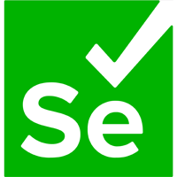
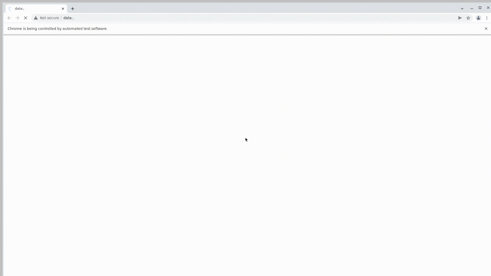

## Проект по тестированию: 

#### WEB - https://www.bmw.ru/
#### MOBILE - https://vkusvill.ru/
#### API - http://shop.bugred.ru/
  

## Технологии, используемые в данном проекте

 

 

В данном проекте автотесты написаны на **Python** с использованием фреймворка для тестирования **Selene\Selenium**.

Запуск тестов выполняется из **Jenkins**. **Selenoid** используется для запуска браузеров в контейнерах **Docker**. 

**Browserstack** используется для запуска мобильных тестов, для запуска на эмуляторе используются **Android Studio** и **Appium**. 

**Allure Report** и **Telegram Bot** используются для визуализации результатов тестирования.

 

## Тест кейсы

### Тест кейсы для UI тестирования

✓ Тест на проверку элементов навигации на главной странице

✓ Тест на поиск вакансии

✓ Тест на просмотр определенной модели авто

✓ Тест на поиск компании Kodix

✓ Тест проверки локации

### Тест кейсы для api тестирования

✓ Тест создания элемента

✓ Тест на проверку созданного элемента

✓ Тест на обновление элемента

✓ Тест на проверку элемента в БД

✓ Тест на удаление элемента

### Тест кейсы для mobile тестирования

✓ Тест swipe основных элементов

✓ Тест на определение локации

✓ Тест на удаления информации

✓ Тест на просмотр контактов

✓ Тест просмотра программы лояльности

 

## Информация о тестах в [Allure report](https://jenkins.autotests.cloud/job/Elieeeya_qa_guru_final/allure/)

### Главное окно

### Окно с тестовыми кейсами

### Окно с графиками

## Уведомление в Telegram

После завершения тестов отчет о прохождении приходит в Telegram с помощью заранее созданного бота

### Видео прохождения UI тестов (пример)

### Видео прохождения mobile тестов (пример)

